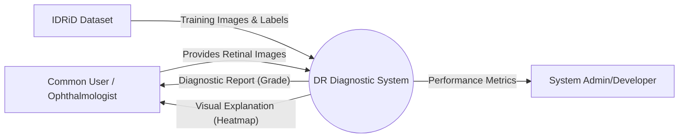
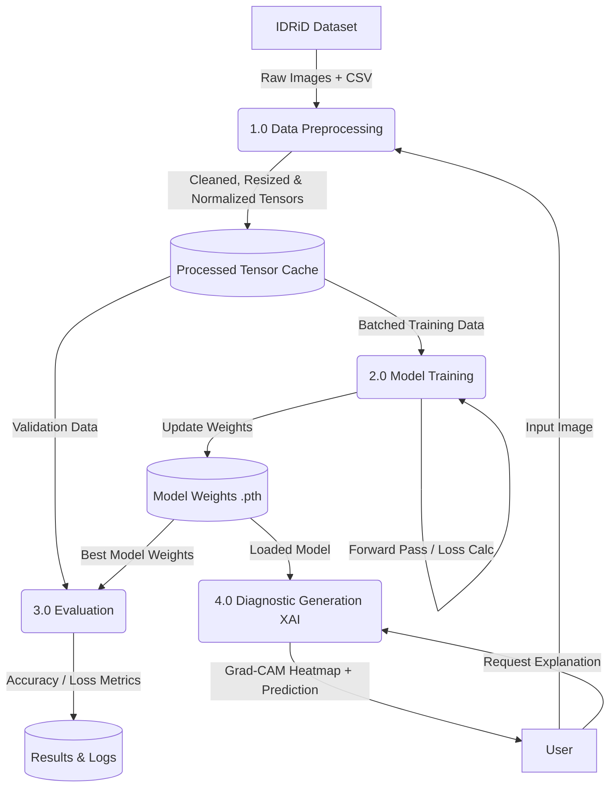
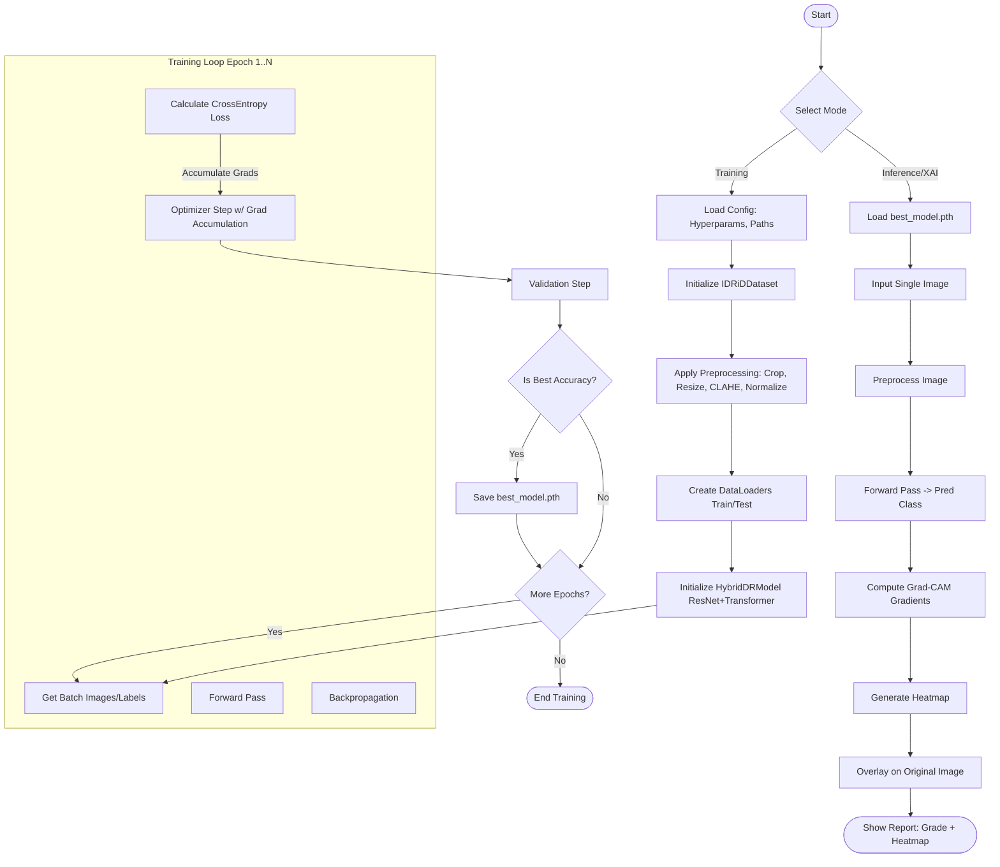

# Project Analysis and Data Flow Diagrams

## 1. Project Analysis

### **System Overview**
The **Diabetic Retinopathy Diagnostic System** is a hybrid deep learning framework designed to classify retinal fundus images into five grades of diabetic retinopathy (0-4). It integrates a **ResNet50 backbone** for spatial feature extraction with a **Transformer Encoder** for capturing global context, enhancing classification accuracy. Additionally, it includes an **Explainable AI (XAI)** module using **Grad-CAM** to provide visual diagnostic reports (heatmaps) aiding clinicians in understanding the model's decisions.

### **Architecture Components**
*   **Data Source**: IDRiD Dataset (Images + CSV Labels).
*   **Preprocessing Module**:
    *   **Cropping**: Removes uninformative black borders from fundus images using `crop_image_from_gray`.
    *   **Resizing**: Standardizes inputs to 512x512 pixels.
    *   **Enhancement**: Applies CLAHE (Contrast Limited Adaptive Histogram Equalization) to improve local contrast.
    *   **Normalization**: Standard ImageNet normalization.
*   **Model Architecture (`HybridDRModel`)**:
    *   **Feature Extractor**: ResNet50 (pre-trained, last layers removed).
    *   **Projection**: 1x1 Conv to reduce channels (2048 -> 512).
    *   **Global Context**: Transformer Encoder (2 layers, 8 heads).
    *   **Classifier**: Global Average Pooling + Fully Connected Layer.
*   **Training Pipeline**:
    *   Uses `CrossEntropyLoss` with class weighting to handle imbalance.
    *   `AdamW` optimizer.
    *   Gradient Accumulation for effective batch size management.
    *   Saves `best_model.pth` based on validation accuracy.
*   **Explainability (XAI)**:
    *   **Grad-CAM**: Computes gradients of the target class w.r.t. the last convolutional layer activations to generate attention heatmaps.

---

## 2. Data Flow Diagrams (DFD)

### **Context Diagram (Level 0 DFD)**
This diagram represents the system as a single high-level process interacting with external entities.

### **Level 1 DFD (Logical Data Movements)**
This diagram breaks down the system into its major sub-processes and data stores.

---

## 3. System Flowchart

This flowchart illustrates the control logic from start to finish, including the training loop and inference logic.

