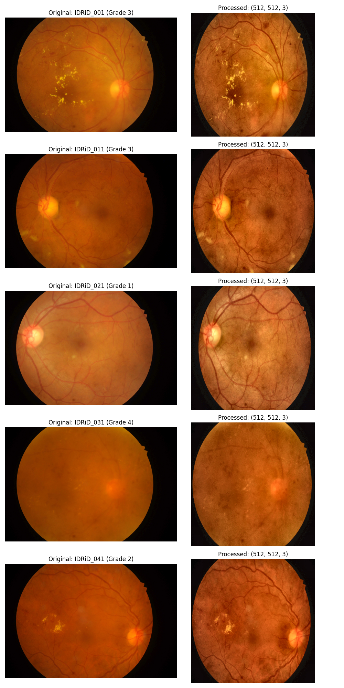
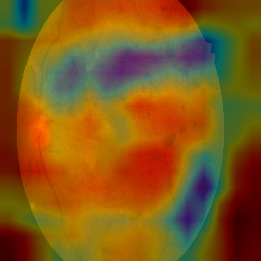
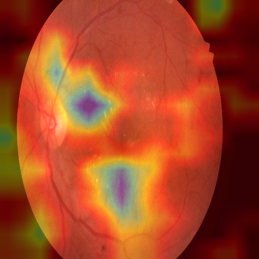
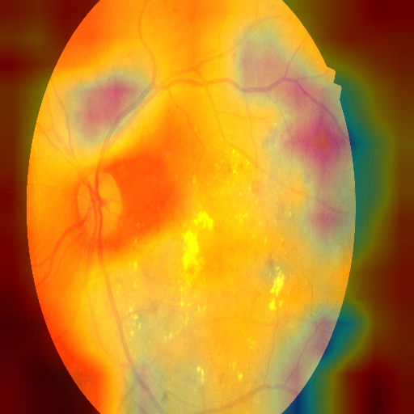
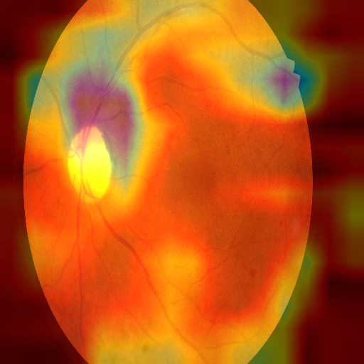

# Project XAI-DR: Clinically Transparent AI for Diabetic Retinopathy

## Overview
**Project XAI-DR** is a research initiative designed to bridge the gap between high-performance Deep Learning models and clinical trust. We have developed a **Hybrid CNN-Transformer** framework that not only classifies Diabetic Retinopathy (DR) severity with high accuracy but also provides **visual explanations** for its decisions using Grad-CAM.

This system is designed to assist ophthalmologists by providing a "second opinion" that is both accurate and interpretable, highlighting the specific lesions (microaneurysms, exudates, etc.) that led to the diagnosis.

## Key Features
-   **Hybrid Architecture**: Combines **ResNet50** (for local feature extraction) with a **Transformer Encoder** (for global context and spatial relationships).
-   **Robust Preprocessing**: Automated pipeline including circular cropping, resizing, and **CLAHE** (Contrast Limited Adaptive Histogram Equalization) to enhance retinal structures.
-   **Explainable AI (XAI)**: Integrated **Grad-CAM** module that generates intuitive heatmaps, showing exactly where the model is looking.
-   **Diagnostic Reports**: Automatically generates composite images of the original fundus + heatmap + prediction confidence.

## Installation

1.  Clone the repository.
2.  Install dependencies:
    ```bash
    pip install -r requirements.txt
    ```
    *Dependencies include: `torch`, `torchvision`, `opencv-python`, `pandas`, `matplotlib`, `tqdm`.*

## Usage

### 1. Data Preparation
Ensure the **IDRiD** dataset is placed in the `datasets` directory. The system expects the standard IDRiD structure.

### 2. Training
To train the model (default is a fast demo mode, modify `src/train.py` for full training):
```bash
python -m src.train
```

### 3. Evaluation & Reporting
To evaluate the model on the test set and generate diagnostic reports:
```bash
python -m src.evaluate
```

## Results

### Preprocessing Pipeline
We employ a rigorous preprocessing step to ensure data quality.


### Diagnostic Reports (Grad-CAM)
The following examples demonstrate the model's ability to localize relevant retinal features. The heatmaps (red/yellow) indicate regions of high importance for the prediction.

| Case 1 | Case 2 |
| :---: | :---: |
|  |  |
| **Ground Truth: 4 | Pred: 3** | **Ground Truth: 2 | Pred: 2** |

| Case 3 | Case 4 |
| :---: | :---: |
|  |  |
| **Ground Truth: 3 | Pred: 3** | **Ground Truth: 3 | Pred: 2** |

## Future Work
-   **Full-Scale Training**: Train on the complete dataset for 50+ epochs to achieve state-of-the-art accuracy.
-   **Clinical Validation**: Conduct a study with ophthalmologists to rate the usefulness of the generated explanations.
-   **Deployment**: Wrap the model in a web interface (e.g., Streamlit or FastAPI) for real-time clinical use.

---
*Developed as part of the XAI-DR Research Initiative.*
